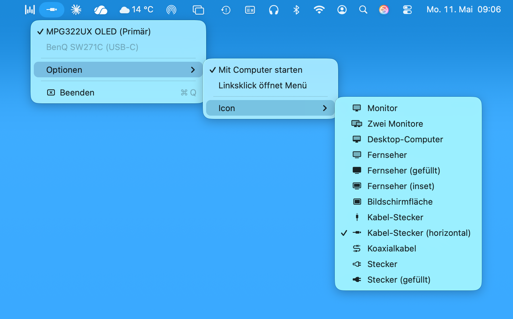

# DisplayPower

Lightweight macOS menu bar app that hides external HDMI monitors from macOS with a single click.



## The Problem

The cable is still plugged in — and that's enough for macOS to treat the monitor as active.

When you connect an HDMI monitor to your Mac and later turn it off or switch it to another input, the classic problem occurs: macOS doesn't notice the physical change. As long as the HDMI cable is plugged in, the operating system considers the monitor connected and active — regardless of what's visible on screen.

The consequences:

- Windows and apps move to the "off" monitor and seem to disappear
- The desktop arrangement changes, Spaces shift
- The screensaver or energy saving mode may not work as expected because macOS assumes an active second screen
- Unplugging the cable is often not an option — for example in fixed setups or when the monitor switches between devices via KVM

## The Solution

DisplayPower uses a targeted trick: instead of "deactivating" the monitor (which macOS doesn't allow through public APIs), it's configured as a **mirror of the main screen**.

The result: macOS no longer treats the HDMI monitor as an independent workspace. All windows, Spaces and apps stay on the main screen — the external monitor still exists for macOS, but no longer occupies its own desktop area. The screensaver and energy saving mode orient themselves to the main screen again.

The cable can stay plugged in.

## How It Works

- **Left-click** on the menu bar icon toggles the selected monitor on or off
- **Right-click** opens the settings menu
- Optional: **left-click opens menu** (toggle multiple monitors directly)

Toggling uses `CGConfigureDisplayMirrorOfDisplay` — exclusively public APIs, no private frameworks.

## Features

- Quick toggle with a single left-click
- Monitor selection when multiple external displays are connected
- Menu-click mode: menu instead of direct toggle, checkmark shows on/off status
- Selectable menu bar icon (monitor, TV, HDMI, cable, …)
- Launch at login
- Localized in 19 languages

## Limitations

Displays connected via **USB-C/Thunderbolt** or **DisplayLink** adapters cannot be controlled through the public CoreGraphics API. They appear grayed out in the menu with the connection type shown as a hint.

## Installation

1. Download [`DisplayPower-v1.0.2.dmg`](https://github.com/deutekom/display-power/releases/latest)
2. Open the DMG and drag `DisplayPower.app` to your Applications folder

> **Gatekeeper notice:** Since the app is not signed with a paid Apple Developer certificate, macOS blocks the first launch.
>
> **macOS Tahoe (15/16) and newer:** After the first launch attempt, go to **System Settings → Privacy & Security** and scroll down — a notice will appear with the option "Open Anyway".
>
> **Older macOS versions:** **Right-click → Open → Open** to confirm.
>
> After that, the app starts normally.
>
> **Missing the notice in Privacy & Security after an update?** This can happen when macOS doesn't re-display the quarantine attribute after a reinstall. Fix via Terminal:
>
> ```bash
> xattr -dr com.apple.quarantine /Applications/DisplayPower.app
> ```
>
> After that, the app launches directly.

## Requirements

- macOS 12 or newer
- Apple Silicon or Intel Mac

## Build from Source

```bash
git clone https://github.com/deutekom/display-power
cd display-power
swift build -c release
```

The compiled binary is located at `.build/release/DisplayPower`.

## License

MIT

---

# Deutsch

Schlanke macOS-Menüleisten-App, die externe HDMI-Monitore für macOS gezielt „unsichtbar" macht – per Klick.

## Das Problem

Das Kabel steckt noch drin – und das reicht macOS, um den Monitor als aktiv zu behandeln.

Wer einen HDMI-Monitor an den Mac anschließt und ihn später ausschaltet oder auf einen anderen Eingang umschaltet, erlebt das klassische Problem: macOS bemerkt die physische Änderung nicht. Solange das HDMI-Kabel steckt, gilt der Monitor für das Betriebssystem als verbunden und aktiv – egal was auf dem Bildschirm zu sehen ist.

Die Folgen:

- Fenster und Apps wandern auf den „ausgeschalteten" Monitor und sind scheinbar verschwunden
- Die Desktop-Anordnung verändert sich, Spaces verschieben sich
- Der Bildschirmschoner oder Energiesparmodus greift möglicherweise nicht wie erwartet, weil macOS einen aktiven zweiten Bildschirm annimmt
- Das Kabel abziehen ist oft keine Option – etwa bei fest installierten Setups oder wenn der Monitor per KVM zwischen mehreren Geräten wechselt

## Die Lösung

DisplayPower nutzt einen gezielten Trick: Statt den Monitor zu „deaktivieren" (was macOS über öffentliche APIs gar nicht erlaubt), wird er als **Spiegel des Hauptbildschirms** konfiguriert.

Das Ergebnis: macOS behandelt den HDMI-Monitor nicht mehr als eigenständige Arbeitsfläche. Alle Fenster, Spaces und Apps bleiben auf dem Hauptbildschirm – der externe Monitor existiert für macOS zwar noch, belegt aber keinen eigenen Desktop-Bereich mehr. Der Bildschirmschoner und der Energiesparmodus orientieren sich wieder am Hauptbildschirm.

Das Kabel kann weiterhin stecken bleiben.

## Funktionsweise

- **Linksklick** auf das Menüleisten-Icon schaltet den ausgewählten Monitor ein oder aus
- **Rechtsklick** öffnet das Einstellungsmenü
- Optional: **Linksklick öffnet Menü** (mehrere Monitore direkt togglen)

Das Ein- und Ausschalten erfolgt über `CGConfigureDisplayMirrorOfDisplay` – ausschließlich öffentliche APIs, keine privaten Frameworks.

## Features

- Schneller Toggle per Linksklick
- Auswahl des Ziel-Monitors bei mehreren externen Displays
- Menu-Click-Modus: Menü statt direktem Toggle, Haken zeigt Ein-/Aus-Status
- Wählbares Menüleisten-Icon (Monitor, TV, HDMI, Kabel, …)
- Autostart beim Login
- Lokalisiert in 19 Sprachen

## Einschränkungen

Displays, die über **USB-C/Thunderbolt** oder **DisplayLink**-Adapter angeschlossen sind, lassen sich nicht über die öffentliche CoreGraphics-API steuern. Sie erscheinen ausgegraut im Menü mit dem entsprechenden Verbindungstyp als Hinweis.

## Installation

1. [`DisplayPower-v1.0.2.dmg`](https://github.com/deutekom/display-power/releases/latest) herunterladen
2. DMG öffnen und `DisplayPower.app` in den Programme-Ordner ziehen

> **Gatekeeper-Hinweis:** Da die App nicht mit einem kostenpflichtigen Apple Developer-Zertifikat signiert ist, blockiert macOS den Start.
>
> **macOS Tahoe (15/16) und neuer:** Nach dem ersten Startversuch unter **Systemeinstellungen → Datenschutz & Sicherheit** nach unten scrollen – dort erscheint ein Hinweis mit der Option „Trotzdem öffnen".
>
> **Ältere macOS-Versionen:** **Rechtsklick → Öffnen → Öffnen** bestätigen.
>
> Danach startet die App normal.
>
> **Nach einem Update fehlt der Hinweis in Datenschutz & Sicherheit?** Das kann passieren, wenn macOS das Quarantäne-Attribut nach einer Neuinstallation nicht erneut anzeigt. Abhilfe per Terminal:
>
> ```bash
> xattr -dr com.apple.quarantine /Applications/DisplayPower.app
> ```
>
> Danach lässt sich die App direkt starten.

## Voraussetzungen

- macOS 12 oder neuer
- Apple Silicon oder Intel Mac

## Selbst bauen

```bash
git clone https://github.com/deutekom/display-power
cd display-power
swift build -c release
```

Das fertige Binary liegt unter `.build/release/DisplayPower`.

## Lizenz

MIT
